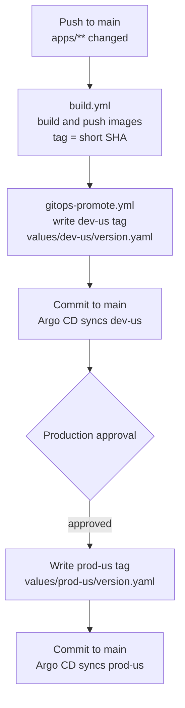
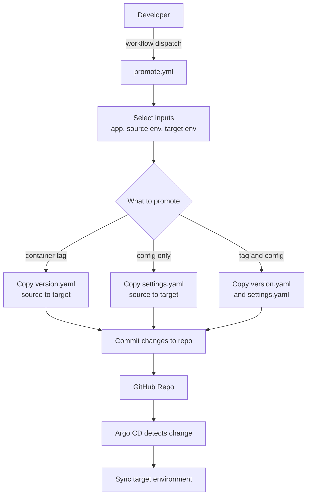

# k8s-workshop-argo-platform


GitOps-based Kubernetes platform showcasing **Argo CD + Helm + Terraform** with a practical **CI/CD promotion model**:

## CI/CD & GitOps Promotion Flow

- Build/push images only for changed services
- Auto-bump **dev** to the freshly built tag
- Require an **environment approval gate** before promoting the *same tag* to **prod**
- Support **manual promotions** via workflow dispatch (copy tag and/or config between env overlays)


## Setup

This repo ships with **two Terraform stacks** for running ArgoCD platforms:

- `terraform/k3d`: **local, free k3d-based Kubernetes** for easy Argo CD testing with no cloud bill. See [`terraform/k3d/README.md`](./terraform/k3d/README.md) for tooling prerequisites, local cluster creation, and ArgoCD bootstrap.
- `terraform/aws`: **full AWS EKS platform** to run the same ArgoCD setup "for real" with controllers and DNS, including **external-dns** and the **AWS Load Balancer Controller**. See [`terraform/aws/README.md`](./terraform/aws/README.md) for AWS prerequisites, controllers, and DNS wiring.
- `argocd/`: ArgoCD **CRDs and GitOps patterns** (e.g., `ApplicationSet`, `Application`, cluster generators, app-of-apps).
- `charts/`: Helm charts for each app.
- `values/`: **env-specific values and overlays** (`values/<app>/<env/values.yaml`, `values/<app>/<env>/version.yaml`).

## GitOps CI/CD Automation



- **Build changed services (`.github/workflows/build.yml`)**: On pushes to `main` that touch `apps/**`, paths-filter detects only the changed app directories and builds/pushes GHCR images tagged with the short SHA. An artifact (`changed-apps.json`) lists which apps moved.
- **Bump dev with the built tag (`gitops-bump-tags`)**: The follow-on workflow `.github/workflows/gitops-promote.yml` listens for successful `build.yml` runs, reads the `changed-apps.json` artifact, and uses the composite action `./.github/actions/gitops-bump-tags` to write that same tag into each `values/<app>/dev-us/version.yaml`. This job targets the `development` environment.
- **Gated prod promotion of the same tag (`gitops-promote`)**: After dev bumps, the same workflow pauses on the `production` environment gate before writing the identical tag into `values/<app>/prod-us/version.yaml`. Configure environment protection rules to require manual approval, ensuring prod only moves when explicitly approved.

## Manual promotions (copy tags + settings between envs)



- Use the manual dispatch workflow `.github/workflows/promote.yml` to promote either direction (e.g., `dev-us → prod-us` or `prod-us → dev-us`) per app.
- Inputs let you choose the app (`web-ui` or `api`), source/target envs, and whether to copy just the container tag (`version.yaml`) or also the overlay settings (`settings.yaml`).
- The workflow copies `values/<app>/<source_env>/version.yaml` to the target when `promote_container` is true and copies `settings.yaml` when `promote_configmaps` is true, then auto-commits.
- Handy for manual cherry-picks, rollbacks, or syncing lower envs to prod settings.


## ArgoCD - how env overlays and the ApplicationSets work

### Chart layout and overlays
- Base chart per app lives under `charts/<app>` (e.g., `charts/web-ui`).
- Environment overlays live under `values/<app>/<env>/values.yaml` (e.g., `values/web-ui/dev-us/values.yaml`).
- Helm merges overlays on top of the base `values.yaml` in order (base first, overlay later). This is where per-env replicas, resources, and ingress hosts are set.

### Promotions (version.yaml override)
- We use a late-applied `version.yaml` per env to override only the image tag; it should be the last file under `helm.valueFiles` in ApplicationSet or Application CRD so it wins merges.
- Example:
```yaml
path: charts/{{path.basename}}            # chart source (charts/web-ui or charts/api)
helm:
    valueFiles: # NOTE: Later files override earlier files
    - values.yaml              # base chart values
    - envs/dev-us/values.yaml  # env defaults
    - envs/dev-us/version.yaml # <-- tag/digest
```

- Promotion flow:
  - When ready to promote, copy the tag from lower env to higher env by copying the version file (or just its `image.tag`) from `dev-us` to `prod-us` and commit.
  - Argo CD will detect the change (via webhook or poll) and sync, deploying the new version to the target environment.

## Rollbacks (simple & auditable)
Git revert the commit that changed the `version.yaml` → Argo CD rolls back to the prior image.
(Optional) keep an Argo Rollouts canary/blue-green strategy for safer Prod flips.

## CI flow using Image Updater (Dev via Image Updater, promotions via version.yaml)

- Dev environments (e.g., dev-us): Argo CD Image Updater watches your dev Application and writes back the latest image tag to the env’s `version.yaml` in Git (write-back: git). Argo then syncs dev automatically.
- Higher environments (e.g., staging/prod): promotions are explicit. CI reads the tag from the build step and commits to the respective envs `version.yaml`

Minimal GitHub Actions shape

- CI: Build → Push to GHCR
- Dev CD: CI/Image Updater bumps `values/<app>/dev-us/version.yaml` → Argo CD syncs
- Promote: github action `environment` gates → after approval, workflow commits tag to version.yaml → Argo CD syncs

Why this pattern
- Dev moves fast automatically; prod remains gated and predictable.
- Only the tag file (version.yaml) changes per promotion; overlays (replicas/resources/ingress) are stable per env.


## Notes
- Ensure your ApplicationSet lists `values/<app>/<env>/version.yaml` last in `helm.valueFiles` so it wins merges.
- If your migration job must always match the app image, make its chart template inherit the app tag (so you only promote one tag). If you manage a separate migration image tag, also put it in `version.yaml` and have CI write both.
- For multi-app promotions, add a matrix or run the write step for each app.

- Argo uses the `Application` name as the Helm release name (e.g., `dev-web-ui`).
- The chart helpers are set up to avoid duplicate suffixes (e.g., `dev-web-ui-web-ui`). If you prefer a fixed name, set `fullnameOverride` in values or set `spec.source.helm.releaseName` in the `ApplicationSet`.


## Helpful Sources
Promotions: [promotions-between-envs](https://www.youtube.com/watch?v=lN-G9TV9Ty0)
