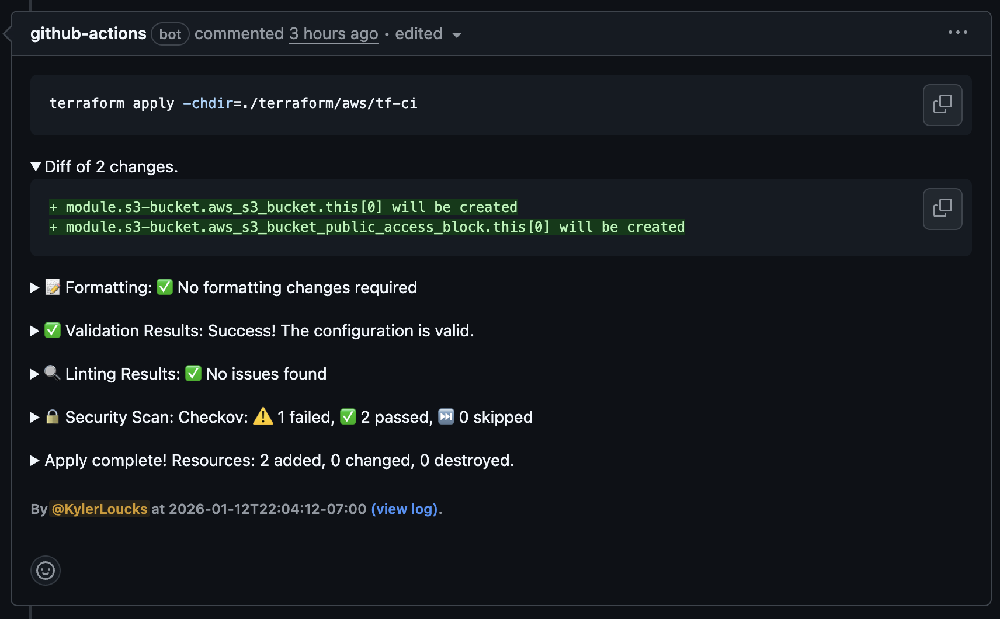
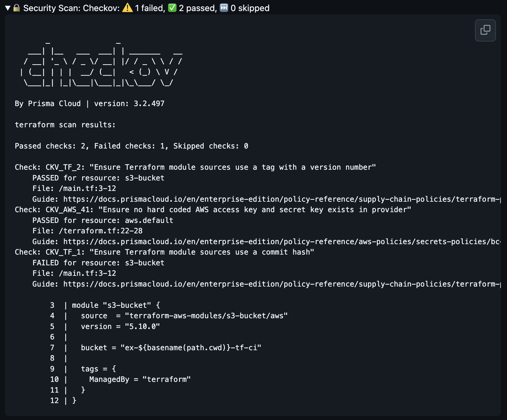
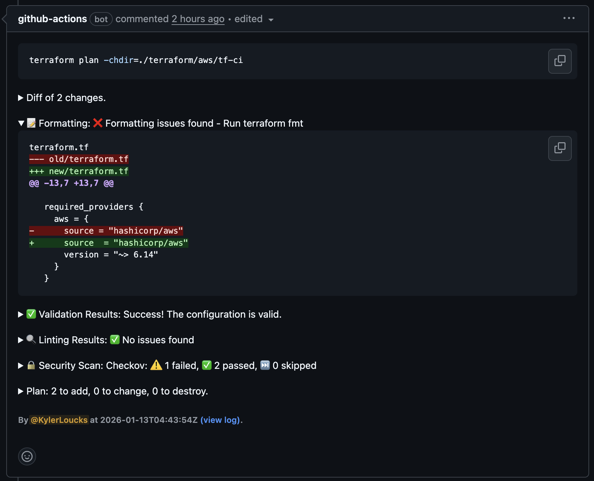

# tf-ci

This folder holds a minimal Terraform stack used to showcase the GitHub Actions workflow that runs `terraform plan` on pull requests and `terraform apply` on merges to `main`. The workflow lives at `.github/workflows/tf-ci.yml` and invokes the composite action in `.github/actions/terraform-ci`.

You can also trigger the workflow manually via the **workflow_dispatch** input to test plan/apply runs without opening a PR.

## PR Comment

Encrypted plan artifact diff:

Plan output:

Checkov security scan:

Terraform fmt fails:

